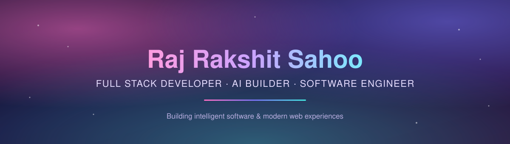

<div align="center">



<br/>


<br/><br/>

<a href="https://git.io/typing-svg">
  
</a>

<br/>

<a href="https://rajrakshitsahoo.github.io"></a>
<a href="https://github.com/RajRakshitSahoo"></a>
<a href="https://linkedin.com/in/raj-rakshit-sahoo-78718b3b3"></a>
<a href="mailto:rajrakshit500@gmail.com"></a>

<br/><br/>


</div>

<br/>

## ✨ About Me

I'm a **full-stack developer and AI builder** pursuing B.Tech in Computer Science Engineering at **C.V. Raman Global University, Bhubaneswar**. I love turning raw ideas into polished, working products — spanning AI-powered applications, full-stack platforms, and interactive experiences.

Currently building **DevFlow AI** — an AI-powered developer productivity platform combining project management, an AI code assistant, and GitHub integration into a single workspace. Also serving as a **Campus Ambassador for Google Gemini AI**.

```javascript
while (alive) {
  learn();
  build();
  experiment();
  ship();
}
```

<br/>

## 🧠 Tech Stack

<div align="center">


</div>

<br/>

## 🚀 Featured Projects

<table>
<tr>
<td width="50%" valign="top">

### 🤖 DevFlow AI
AI-powered developer productivity platform — project management, AI code assistant, Kanban, GitHub integration & analytics.

`Next.js` `TypeScript` `Node.js` `PostgreSQL` `Prisma`

</td>
<td width="50%" valign="top">

### 🧠 CodeVault AI
AI-powered coding assistant platform, making dev workflows smarter and more productive.

`Python` `AI` `Machine Learning`

</td>
</tr>
<tr>
<td width="50%" valign="top">

### 💼 CareerConnect
Full-stack career networking platform connecting users with opportunities and resources.

`Next.js` `Node.js` `MongoDB` `JWT`

</td>
<td width="50%" valign="top">

### 👔 Employee Management System
Full-stack employee management app with org-chart visualization and animated UI.

`Java 21` `Spring Boot 3` `Angular 19` `MySQL`

</td>
</tr>
<tr>
<td width="50%" valign="top">

### 🎮 Browser-Based Horror Game
Interactive browser horror experience focused on atmosphere and immersive interaction.

`HTML` `CSS` `JavaScript`

</td>
<td width="50%" valign="top">

### 👗 Fashion Recommendation System
ML-based clothing recommendation engine suggesting outfits from user inputs.

`Python` `Machine Learning` `Flask`

</td>
</tr>
</table>

<br/>

## 📊 GitHub Analytics

<div align="center">


<br/><br/>


<br/><br/>


</div>

<br/>

## 🐍 Contribution Snake

<div align="center">


</div>

<br/>

## 📡 Connect

<div align="center">

<a href="https://github.com/RajRakshitSahoo"></a>
<a href="https://linkedin.com/in/raj-rakshit-sahoo-78718b3b3"></a>
<a href="mailto:rajrakshit500@gmail.com"></a>

</div>

<br/>

<div align="center">

</div>
